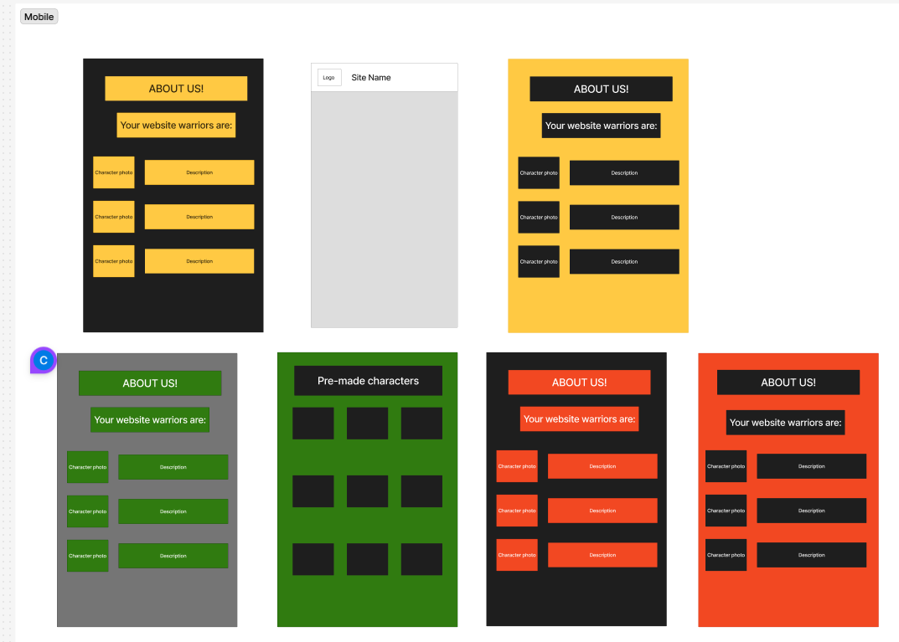
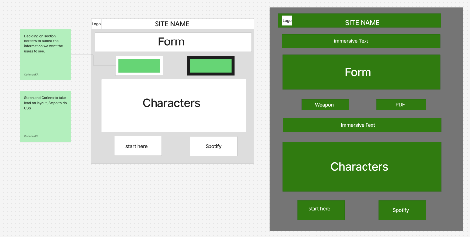
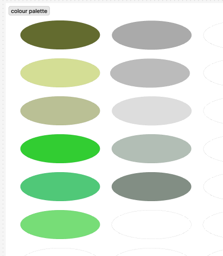

# Tech Ed week 5 group assignment

Consolidate your knowledge of full-stack development by designing and building a web application that showcases your skills in HTML, CSS, client-side JavaScript, server-side JavaScript with Express, and database interactions using Postgres.

## Reflection

..

## Requirements / User Stories

#### Main Goals

- ✅ 🎯 I want users to be able to submit a character idea
- ✅ 🎯 I want to view submitted characters
- ✅ 🎯 I want to be able to use a item generator
- ✅ 🎯 I want to be able to download a blank character sheet

#### Stretch Goals

- ✅ 🏹 Spotify embed for the playlist
- 🏹 Image pull field for any characters that people submit
- 🏹 I want to be able to explore multiple pages
- 🏹 I want to roll a D20 for initiative
- 🏹 I want videos for different atmospheres (iframe)
- 🏹 I want the cursor to be a wand (toggle)

## Wireframe

- overall review about the wireframe

- something about this image

 

- something about this image

- something aboout this image

## Errors or Bugs I Encountered

..

## What went really well and what could have gone better?

..

## External sources

#### Info

[Tech Ed repo](https://github.com/Tech-Educators/software-dev-021) , [FigJam](https://www.figma.com/board/JjN2Zgtoynrau06MjWJs6q/SD021?node-id=0-1&p=f&t=V1WCGcrmVKnoxJDr-0) , [MDN](https://developer.mozilla.org/en-US/) , [W3School](https://www.w3schools.com/)

#### Render & Supabase

[Sam's set-up guide](https://github.com/IndieMasco/TechEdSoftwareDeveloper021/blob/main/week4/render-and-supabase/READme.md)

#### Downloadable PDF

[Link A Webpage Button To An Internal PDF](https://www.youtube.com/watch?v=sWHcoekPKCU) , [Stack Overflow - Downloadable PDF](https://stackoverflow.com/questions/2906582/how-do-i-create-an-html-button-that-acts-like-a-link)
